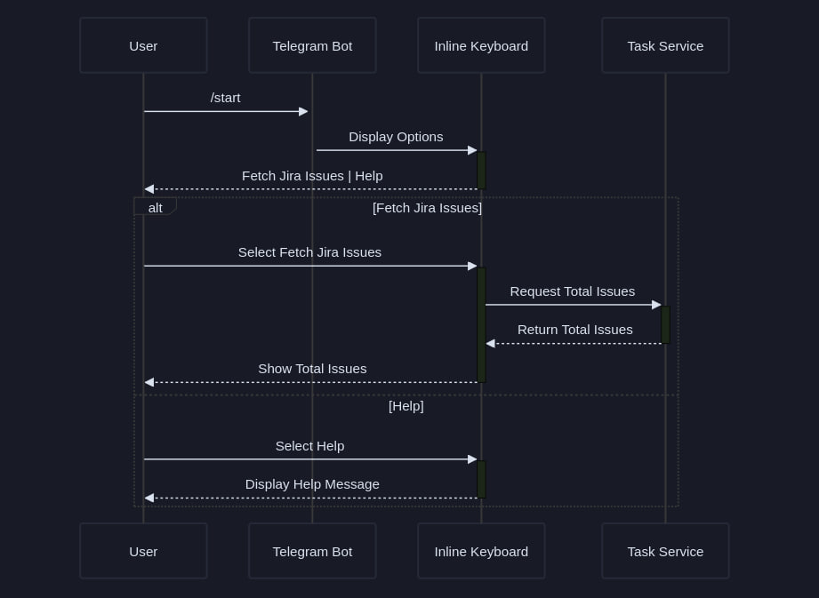

# Telegram Bot Connector for JIRA, Eva, and Bitrix

Этот проект представляет собой основу для будущего Telegram бота-коннектора, который будет интегрироваться с JIRA, Eva и Bitrix для агрегации данных о задачах. 

### Структура проекта
Проект включает следующие ключевые файлы:

- `app/config.py`: Управление конфигурацией подключения к JIRA и Telegram
- `app/jira_dao.py`: Класс `JiraDAO`, реализующий взаимодействие с JIRA REST API для поиска задач. Подробнее о API см. [здесь](https://developer.atlassian.com/cloud/jira/platform/rest/v3/api-group-issue-search#api-rest-api-3-search-get).
- `app/main.py`: Запускает Telegram-бот 
- `app/telegram_bot.py`: Модуль настраивает Telegram-бот и  взаимодействует с пользователями с помощью встроенных кнопок клавиатуры. Бот реализован с использованием библиотеки [python-telegram-bot](https://github.com/python-telegram-bot/python-telegram-bot.git)
- `app/task_service.py`: Модуль Python, содержащий класс `TaskService`,  предоставляет методы управления задачами в проекте JIRA:
  `get_total_issues_jira(self, query)`: метод извлекает общее количество задач в проекте JIRA.


### Особенности
- Получение общего количества задач из JIRA
- Возможность расширения для интеграции с Eva и Bitrix
- Простой командный интерфейс в Telegram
- Асинхронная обработка запросов для повышения эффективности

### Использование
Отправьте `/start` боту в Telegram для начала работы. `handle_keyboard` отобразит клавиатуру пользователю и предложит ему выбрать действие.
- Команда `Fetch Jira Issues`: извлекает общее количество задач JIRA и соответствующим образом обновляет сообщение.
- Команда`Help`: предоставляет пользователю инструкции. 





### Установка
1. Клонируйте репозиторий. 
2. Установите зависимости: `pip install -r requirements.txt`. 
3. Настройте `.env` с вашими токенами для JIRA и Telegram. 
4. Запустите бота командой: `python app/main.py`.

### Конфигурация
 Файл `app/config.py` должен быть настроен со следующими параметрами:  
 
```plaintext
JIRA_URL=https://your-domain.atlassian.net 
JIRA_USER=email@example.com 
JIRA_TOKEN=your_api_token 
TELEGRAM_TOKEN=your_telegram_bot_token
```


### Планы на будущее
- Интеграция с EVA и Bitrix.
- Разработка в Telegram боте большего количества функционала для удобного доступа к агрегированным данным о задачах.

